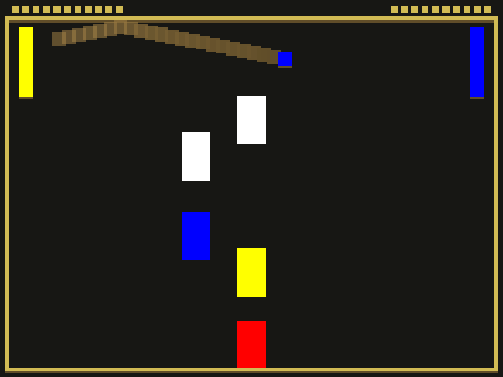

# Color Breakout Pong
Author: Jianxiang Li

Design: Pong with Breakout-like bricks in the middle of the panel. 
Player will need to not only catch the ball, but also mind the match of color and reflections of bricks.

Screen Shot:

How To Play:

Goal

* Control the paddle to catch the ball with correct color and avoid letting the ball hit the left court wall.
* Earn 1 point if the ball hits the right court wall (ai side). Lose 1 point if the ball hits the left court wall (player side).

Controls

* The left paddle follows the movement of the mouse.
* Click mouse to switch a paddle color. It iterates through all the colors in the order of white, red, yellow, blue, and white again.

Colors

* There are 4 colors for this game:  white, red, yellow, blue.
* Paddles have to be in the same color with the ball to catch the ball, or the ball will go through the paddle without collision.
* Ball changes to the color of brick it hits.

Bricks

* Bricks appears at random position with random color in the middle of the game panel.
* Bricks disappears when the ball hits it. A new brick is spawned at a different position afterwards.

Difficulty

* Number of bricks increases as the score increases.
* Speed of ball goes faster as the score increases.

This game was built with [NEST](NEST.md).
